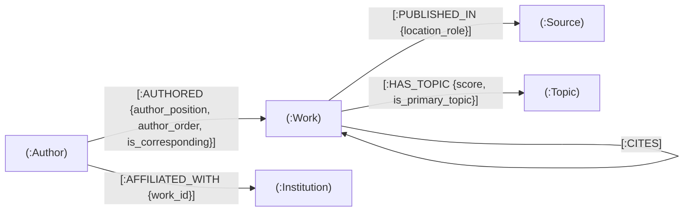

## Scope and source contract

The Neo4j graph database is loaded only from the Milestone 3 reconciled CSV files in `data/processed/`. It never reads raw nested OpenAlex JSON.

The graph uses the same frozen processed snapshot, scope, compact canonical OpenAlex identifiers, and relationship semantics as the PostgreSQL relational model. This is required for valid SQL-versus-Cypher correctness, expressiveness, and later performance comparisons.

Canonical identifiers are stored as the unique node property `id`

## Graph model



The directed relationship conventions are:

```text
(:Author)-[:AUTHORED]->(:Work)
(:Author)-[:AFFILIATED_WITH {work_id}]->(:Institution)
(:Work)-[:HAS_TOPIC]->(:Topic)
(:Work)-[:PUBLISHED_IN]->(:Source)
(:Work)-[:CITES]->(:Work)
```

In particular, a citation always points from the citing Work to the cited Work:

```text
(citing Work)-[:CITES]->(cited Work)
```

## Node labels and properties

| Label | Unique identity | Main properties | Source file |
|---|---|---|---|
| `Work` | `id = work_id` | `doi`, `title`, `abstract`, `publication_date`, `publication_year`, `work_type`, `language`, `cited_by_count`, `is_oa`, `oa_status` | `works.csv` |
| `Author` | `id = author_id` | `display_name` | `authors.csv` |
| `Institution` | `id = institution_id` | `display_name`, `country_code`, `institution_type` | `institutions.csv` |
| `Source` | `id = source_id` | `display_name`, `source_type`, `issn_l`, `issn`, `publisher` | `sources.csv` |
| `Topic` | `id = topic_id` | `display_name`, `subfield_id`, `subfield_name`, `field_id`, `field_name`, `domain_id`, `domain_name` | `topics.csv` |

Optional source attributes remain absent/null when the reconciled input field is empty. The graph loader does not invent placeholder names, source metadata, or affiliations.

## Relationship mapping and semantics

| Processed CSV / relational relation | Neo4j representation | Logical identity | Relationship properties | Meaning |
|---|---|---|---|---|
| `authorships.csv` / `authorships` | `(:Author)-[:AUTHORED]->(:Work)` | `(author_id, work_id)` | `author_position`, `author_order`, `is_corresponding` | The Author has an authorship occurrence on the Work. |
| `affiliations.csv` / `affiliations` | `(:Author)-[:AFFILIATED_WITH {work_id}]->(:Institution)` | `(author_id, work_id, institution_id)` | `work_id` | The Author was affiliated with the Institution in the context of authoring the specified Work. |
| `work_topics.csv` / `work_topics` | `(:Work)-[:HAS_TOPIC]->(:Topic)` | `(work_id, topic_id)` | `score`, `is_primary_topic` | The Topic is assigned to the Work. |
| `work_sources.csv` / `work_sources` | `(:Work)-[:PUBLISHED_IN]->(:Source)` | `(work_id, source_id, location_role)` | `location_role` | The Work is associated with the selected publication Source. |
| `citations.csv` / `citations` | `(:Work)-[:CITES]->(:Work)` | `(citing_work_id, cited_work_id)` | None currently | The source Work cites the target Work within the selected corpus. |

### Work-contextual affiliation

An affiliation must not be interpreted as a permanent or timeless statement that an Author belongs to an Institution.

```text
(:Author)-[:AFFILIATED_WITH {work_id: 'W...'}]->(:Institution)
```

represents the exact processed CSV row:

```text
(work_id, author_id, institution_id)
```

The `work_id` property is part of the relationship identity. Therefore, the same Author may have separate `AFFILIATED_WITH` relationships to the same Institution when the affiliations arise from different Works.

For work-scoped analyses, the relationship is linked back to its Work context with this pattern:

```cypher
MATCH (a:Author)-[af:AFFILIATED_WITH]->(i:Institution)
MATCH (a)-[:AUTHORED]->(w:Work {id: af.work_id})
RETURN a, af, i, w;
```

This preserves the same meaning as the relational foreign-key path from `affiliations(work_id, author_id)` to `authorships(work_id, author_id)`.