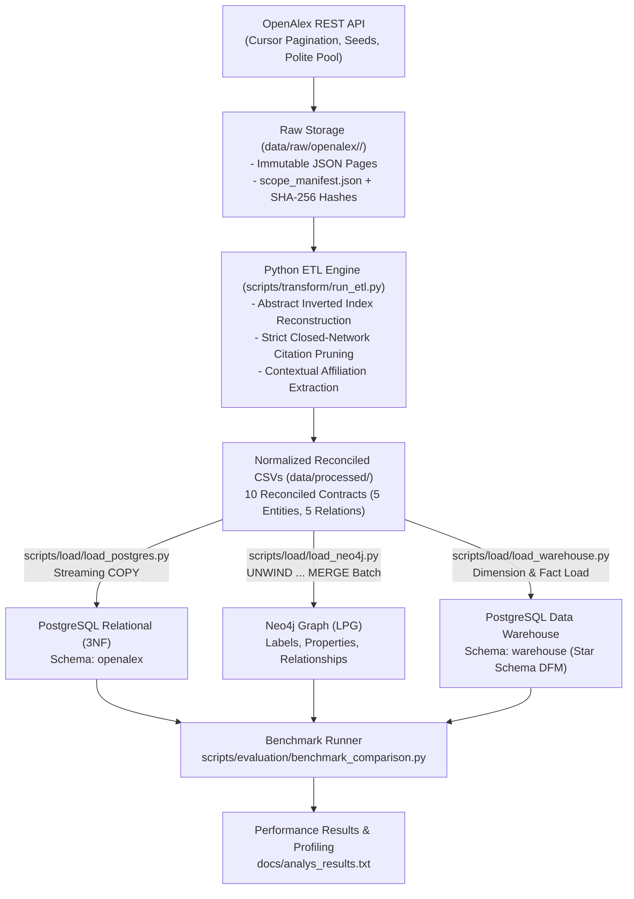
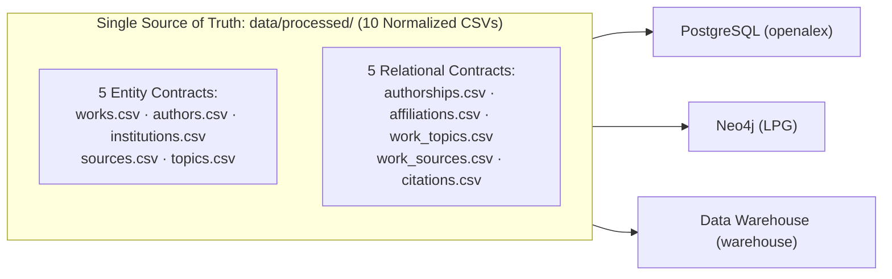
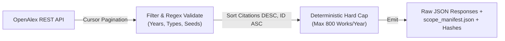
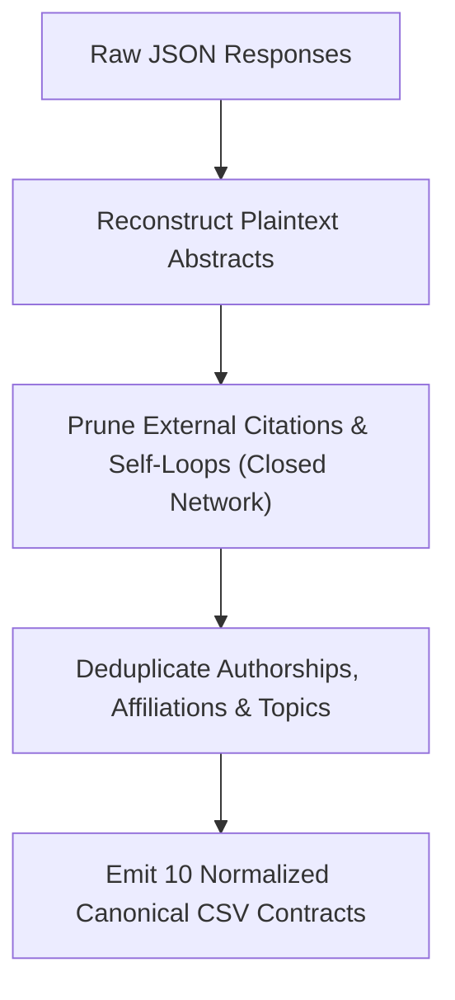
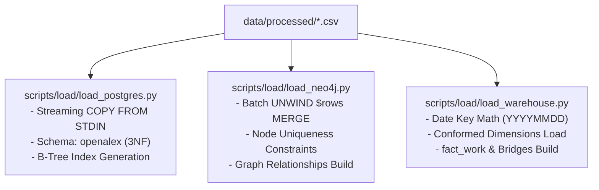
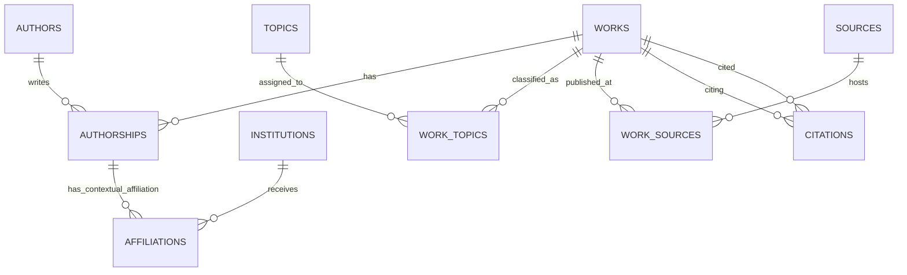
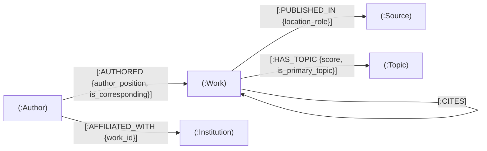
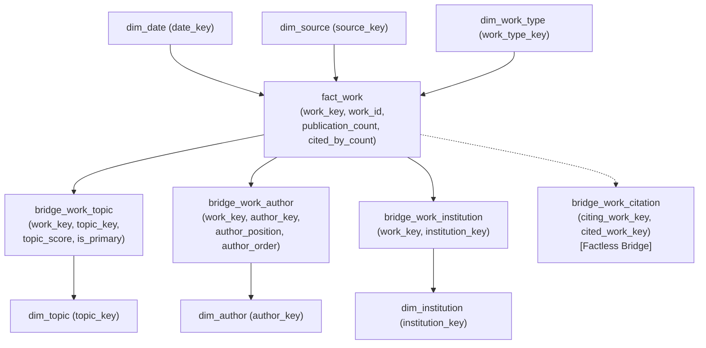
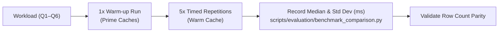

# OpenAlex LLM Analyzer
## Comparative Scholarly Analytics Across Relational, Graph & Data Warehouse Paradigms

**Topic:** Scientific Production & Citation Networks in LLM & Generative AI Research (2020–2025)  
**Technologies:** PostgreSQL 16 (Relational OLTP & Star Schema) · Neo4j 5 (Labeled Property Graph) · Python 3.11+ ETL

---

## 1. Project Purpose & Multi-Paradigm Comparison

### Purpose of the Project
- Build a **fully reproducible, end-to-end multi-paradigm database evaluation system** that extracts scholarly literature on Large Language Models (LLM) and Generative AI (2020–2025) from the OpenAlex API.
- Analyze research dissemination in a fast-moving AI domain: massive preprint volumes (arXiv), rapid citation cascades, heterogeneous multi-author and multi-institutional collaborations, and dynamic topic hierarchies.

### Multi-Paradigm Comparison
Load an **identical frozen dataset** into three distinct database paradigms to evaluate:
1. **Relational Database (PostgreSQL 3NF):** Entity integrity, normalized relational algebra, foreign keys, and B-Tree indexing.
2. **Graph Database (Neo4j LPG):** Index-Free Adjacency (IFA), variable-length topological path traversal, and bipartite network expansions.
3. **Data Warehouse (PostgreSQL Star Schema - DFM):** Dimensional roll-up, drill-down, slicing, and multi-valued bridge table accounting.
- **Evaluation Dimensions:** Query expressiveness (SQL vs. Cypher vs. Star SQL), execution latency (median wall-clock ms), memory behavior, and structural data modeling fit.

---

## 2. End-to-End System Architecture & Workflow



---

## 3. ETL Process: The Common Backbone

### Unified Reconciled Contract (Described Once)
To ensure **100% data and semantic parity**, all three databases are loaded exclusively from a single shared processed layer in `data/processed/`. Neither Neo4j nor the Data Warehouse reads raw API JSON or intermediate relational tables.



- **Parity Guarantees:** Identical entity keys, exact row counts, zero phantom nodes, and zero broken foreign keys across all three backends.

---

## 4. ETL Workflow: Extraction (`scripts/extract/gather.py`)

### API Extraction Rules
- **Source:** OpenAlex REST API `/works` endpoint via cursor pagination (`cursor=*`).
- **Filters:** Publication years 2020–2025; types `article`, `review`, `preprint`.
- **Search Seeds:** `"large language model"`, `"generative AI"`, `"foundation model"`, `"transformer language model"`.
- **Validation:** Regular expression match on `title` and reconstructed `abstract`.
- **Deterministic Capping:** Max 800 works/year (~4,800 max), sorted by `cited_by_count DESC, id ASC`.



---

## 5. ETL Workflow: Transformation (`scripts/transform/run_etl.py`)

### Core Transformation Logic
1. **Abstract Inverted Index Reconstruction:** Reconstructs token positional indexes into complete abstract plaintext.
2. **Closed-Network Citation Pruning:**
   $$\text{Edges Retained} = \{ (u, v) \in \text{Citations} \mid u \in \text{Works}_{\text{retained}} \land v \in \text{Works}_{\text{retained}} \land u \ne v \}$$
   - Prunes external references and work self-loops ($u = v$), eliminating dangling relational foreign keys and phantom graph nodes.
3. **Contextual Affiliations:** Affiliations are contextualized to $(work\_id, author\_id, institution\_id)$.



---

## 6. ETL Workflow: Loading into the Three Databases



- **PostgreSQL 3NF:** High-speed streaming `COPY` loading all 10 tables in under a second; applies check constraints and foreign keys.
- **Neo4j LPG:** Transactional batch loads (1,000 rows/batch) creating nodes first with unique `id` constraints, then matching endpoints to build directed edges.
- **Data Warehouse:** Populates conformed dimensions with integer surrogate keys, resolves surrogate mappings in memory, and writes `fact_work` and bridge tables.

---

## 7. Database Paradigm 1: Relational 3NF (PostgreSQL)

### Model & Schema Characteristics (`openalex` schema)
- Third Normal Form (3NF) relational design in PostgreSQL 16.
- Enforces strict entity integrity, composite primary keys, and foreign keys.
- **Engineered Indexes:** `idx_works_year_type`, `idx_authorships_author`, `idx_affiliations_inst`, `idx_citations_cited`.



---

## 8. Database Paradigm 2: Labeled Property Graph (Neo4j LPG)

### Graph Schema & Index-Free Adjacency (IFA)
- First-class Nodes: `(:Work)`, `(:Author)`, `(:Institution)`, `(:Source)`, `(:Topic)`.
- Typed Relationships: `[:AUTHORED]`, `[:AFFILIATED_WITH {work_id}]`, `[:HAS_TOPIC]`, `[:PUBLISHED_IN]`, `[:CITES]`.
- **Work-Contextual Affiliation:** Stored as `(:Author)-[:AFFILIATED_WITH {work_id}]->(:Institution)`, preventing timeless affiliation distortion.



---

## 9. Database Paradigm 3: Analytical Data Warehouse (Star Schema DFM)

### Dimensional Fact Model (`warehouse` schema)
- **Fact Table:** `fact_work` (Grain: 1 row per work; Measures: additive `publication_count = 1`, semi-additive `cited_by_count`; Degenerate dimension: `publication_year`).
- **Conformed Dimensions:** `dim_date`, `dim_source`, `dim_work_type`, `dim_topic`, `dim_author`, `dim_institution`.
- **Multi-Valued Bridges:** `bridge_work_topic`, `bridge_work_author`, `bridge_work_institution`, `bridge_work_citation` (factless citation bridge). Full association accounting policy preserves fact grain.



---

## 10. The Benchmark Comparison Script: `benchmark_comparison.py`

### Harness Architecture (`scripts/evaluation/benchmark_comparison.py`)
Automated multi-paradigm test harness running semantically identical queries across all three engines:
1. **PostgreSQL Relational:** `openalex` schema (3NF SQL).
2. **PostgreSQL Warehouse:** `warehouse` schema (Star Schema OLAP SQL).
3. **Neo4j LPG:** Bolt driver session (Cypher).

### Rigorous Evaluation Methodology
- **Warm-up Run:** 1 untimed execution per query to prime operating system page caches and database shared buffers.
- **Timed Repetitions:** 5 consecutive warm-cache executions per query.
- **Metrics Collected:** Median, standard deviation ($\pm$), min, and max wall-clock time in milliseconds (ms).
- **Parity Verification:** Validates identical result set row counts across all three engines to verify semantic equivalence.



---

## 11. Comparison Queries & Selection Rationale (Part 1: Q1, Q2A, Q2B)

### Q1: LLM Evolution by Year, Work Type, and Source
- **Query Task:** Roll-up and drill-down of publication counts, average citations, and median citations (`percentile_cont`).
- **Why Chosen:** Baseline OLAP slicing test. Evaluates group-by and statistical aggregates on single tables/nodes without multi-table join overhead.

### Q2A: Top 20 Authors Productivity (Aggregation)
- **Query Task:** Group-by over author-work relationships with publication counts and summed citations.
- **Why Chosen:** Tests $M:N$ tabular aggregation across works and authorships. Evaluates relational C-level `HashAggregate` vs. star bridge joins vs. Cypher `collect(DISTINCT w)` and `reduce()` collection overhead.

### Q2B: Top 20 Institutions (Contextual Affiliations)
- **Query Task:** Distinct work count and citations per institution, respecting work-contextual affiliations.
- **Why Chosen:** Evaluates deduplication across ternary associations. In 3NF requires a `DISTINCT` subquery over `affiliations`; in warehouse joins `bridge_work_institution`; in graph requires matching `af.work_id = w.id`.

---

## 12. Comparison Queries & Selection Rationale (Part 2: Q3, Q4, Q5, Q6)

### Q3: Topic-Field Roll-Up in 2020 (Dimensional Slicing)
- **Query Task:** Hierarchical aggregation up the OpenAlex topic hierarchy (`field_name`) filtered by `publication_year = 2020`.
- **Why Chosen:** Classic dimensional star schema workload. Tests integer surrogate keys and predicate pushdown on `fact_work` vs. normalized multi-table 3NF joins vs. graph property filtering + edge hops.

### Q4: Inter-Institution Collaboration (Diamond Join)
- **Query Task:** Identify pairs of institutions collaborating on works in 2020 ($i_1 < i_2$) with collaborative work counts.
- **Why Chosen:** Tests pairwise collaboration patterns (diamond joins). Relational/warehouse execute self-joins on junction/bridge tables; graph executes symmetric multi-hop pattern `(i1)<-[af1]-(a1)-[:AUTHORED]->(w)<-[:AUTHORED]-(a2)-[af2]->(i2)`.

### Q5: Directed Citation Paths 2–4 Hops (Path Traversal)
- **Query Task:** Discover multi-hop directed citation cascades of length 2 to 4.
- **Why Chosen:** Path traversal benchmark. Specifically contrasts graph **Index-Free Adjacency (IFA)** with relational recursive CTEs (`WITH RECURSIVE` + cycle-guard array checks `NOT c.cited = ANY(p.path)`).

### Q6: Co-Authorship Degree (Two-Hop Bipartite Expansion)
- **Query Task:** Compute author co-authorship degree over shared works in the bipartite author-work network.
- **Why Chosen:** Tests bipartite two-hop expansion. Contrasts Cypher `(a1)-[:AUTHORED]->(w)<-[:AUTHORED]-(a2)` against relational self-joins and `UNION ALL`.

---

## 13. Benchmark Results & Timings (from `analys_results.txt`)

*Data source: `docs/analys_results.txt` (Median wall-clock execution time in ms over 5 warm-cache runs)*

| Workload | Task / Query Description | Relational (ms) | Warehouse (ms) | Graph Neo4j (ms) | Winner |
|---|---|---|---|---|---|
| **Q1** | LLM/Generative-AI Evolution by Year | 2.18 (±0.4) | **1.96 (±0.2)** | 12.21 (±25.7) | **Warehouse** |
| **Q2A** | Top 20 Authors Productivity (Agg) | 60.37 (±0.4) | **18.81 (±0.4)** | 29.60 (±15.8) | **Warehouse** |
| **Q2B** | Top 20 Institutions (Contextual) | 11.83 (±0.3) | **5.90 (±3.6)** | 56.32 (±15.0) | **Warehouse** |
| **Q3** | Topic-Field Roll-Up in 2020 (Dim) | 4.97 (±5.1) | **2.44 (±0.9)** | 7.29 (±6.6) | **Warehouse** |
| **Q4** | Inter-Institution Collaboration | 10.93 (±0.4) | **4.22 (±2.4)** | 22.59 (±11.2) | **Warehouse** |
| **Q5** | Directed Citation Paths 2–4 Hops | 1585.86 (±33.7) | **1272.42 (±12.5)** | 1413.41 (±37.4) | **Warehouse** |
| **Q6** | Co-Authorship Degree (Two-Hop) | 381.86 (±5.4) | 235.48 (±33.7) | **124.23 (±18.4)** | **Graph** |

- **Summary:** Data Warehouse won **6 out of 7** queries (Q1, Q2A, Q2B, Q3, Q4, Q5). Neo4j Graph won **Q6** decisively.

---

## 14. Architectural Analysis of Results

### Why Data Warehouse Dominated Aggregations & Slicing (Q1, Q2A, Q2B, Q3, Q4)
- **Surrogate Integer Keys:** Fast integer hash joins in `bridge_work_author` and `bridge_work_institution` avoid text string UUID comparisons in 3NF.
- **Predicate Pushdown & Compact Grain:** Filtering `fact_work.publication_year = 2020` immediately eliminates non-qualifying rows without table joins.
- **Relational Aggregate Maturity:** PostgreSQL C-level `HashAggregate` is vastly superior to Cypher's Java heap allocation and `collect()` / `reduce()` overhead.

### Why Graph (Neo4j) Won Bipartite Neighborhood Expansion (Q6)
- **Two-Hop Bipartite Expansion:** Neo4j traversed `(:Author)-[:AUTHORED]->(:Work)<-[:AUTHORED]-(:Author)` directly in **124.23 ms** (vs. 235.48 ms Warehouse, 381.86 ms Relational).
- **Avoiding Expensive Self-Joins:** Relational engines required materializing a self-join over authorships, computing bidirectional degrees, and running an expensive `UNION ALL` followed by an outer `GROUP BY`.

### Deep Citation Paths (Q5)
- Warehouse recursive CTE on `bridge_work_citation` achieved **1272.42 ms**, outperforming Neo4j (**1413.41 ms**) and 3NF Relational (**1585.86 ms**). Compact BIGINT arrays in PostgreSQL recursive worktables provided strong in-memory cache locality for this corpus size.

---

## 15. Query Expressiveness: SQL vs. Cypher (Q5 Citation Paths)

### PostgreSQL Recursive CTE (25 lines)
```sql
WITH RECURSIVE citation_paths AS (
  SELECT c.citing_work_id AS start_id, c.cited_work_id AS curr_id,
         ARRAY[c.citing_work_id, c.cited_work_id]::TEXT[] AS path, 1 AS hops
  FROM citations c WHERE c.citing_work_id = :start_id
  UNION ALL
  SELECT p.start_id, c.cited_work_id, p.path || c.cited_work_id, p.hops + 1
  FROM citation_paths p JOIN citations c ON c.citing_work_id = p.curr_id
  WHERE p.hops < 4 AND NOT c.cited_work_id = ANY (p.path) -- Cycle guard
)
SELECT start_id, curr_id, hops, path FROM citation_paths WHERE hops BETWEEN 2 AND 4;
```

### Neo4j Cypher Native Traversal (3 lines)
```cypher
MATCH (start:Work {id: $start_id})
MATCH p = (start)-[:CITES*2..4]->(target:Work)
RETURN length(p) AS hops, [n IN nodes(p) | n.id] AS path;
```
- **Takeaway:** Cypher expresses topological reachability with built-in path uniqueness and pointer chasing; SQL requires manual array cycle tracking and recursive worktable memory overhead.

---

## 16. Paradigm Decision Matrix & Conclusions

| Dimension | PostgreSQL Relational (3NF) | Neo4j Graph (LPG) | PostgreSQL Data Warehouse (Star Schema) |
|---|---|---|---|
| **Optimal Workloads** | Transactional CRUD, data integrity, strict constraints | Topological path traversals, neighbor degree, centrality | Multidimensional slicing, roll-up, drill-down, analytical reporting |
| **Join Scalability** | Joins degrade with depth ($>3$ tables); high memory | **$O(1)$ per hop** via Index-Free Adjacency (pointer chasing) | Star joins against single Fact table; integer surrogate keys |
| **Path Traversal Syntax** | Verbose `WITH RECURSIVE` + array cycle tracking | **Concise Cypher pattern** `[:CITES*2..4]`, built-in uniqueness | Factless relationship bridge required (`bridge_work_citation`) |
| **Aggregation Power** | High (mature SQL window functions, hash aggregates) | Moderate (higher RAM usage with `collect()`/`reduce()`) | **Highest** (optimized star hash joins, pre-computed bridges) |
| **Schema Evolution** | Rigid (requires formal DDL migrations) | **Flexible** (nodes/edges accept dynamic properties) | Structured (dimensional bus architecture) |

### Note on Information Completeness
*All metrics and results are taken directly from `docs/analys_results.txt` and repository source code. Distributed cluster metrics or hardware telemetry beyond local single-node execution were not present in the workspace and should be inserted manually if desired.*
