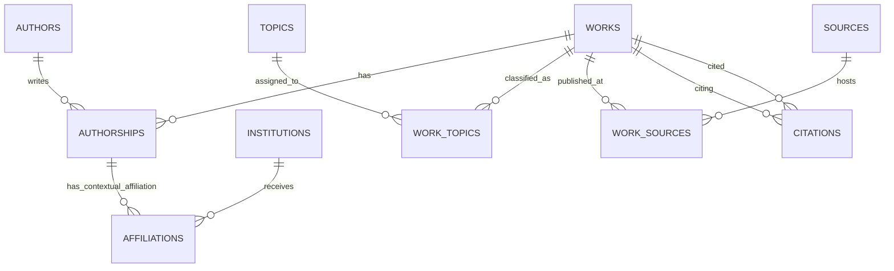

## Scope and source contract

The PostgreSQL relational database is loaded only from the Milestone 3 reconciled CSV files in `data/processed/`. It never reads raw nested OpenAlex JSON. The keys are compact canonical OpenAlex identifiers.

## ER model

## Entities and keys

| Relation | Primary key | Purpose |
|---|---|---|
| `works` | `work_id` | Retained OpenAlex scholarly work |
| `authors` | `author_id` | Author dimension/entity |
| `institutions` | `institution_id` | Institution entity |
| `sources` | `source_id` | Journal, repository, or venue entity |
| `topics` | `topic_id` | OpenAlex topic plus denormalized hierarchy attributes |
| `authorships` | `(work_id, author_id)` | Work–author association and authorship properties |
| `affiliations` | `(work_id, author_id, institution_id)` | Institution affiliation in the authorship context |
| `work_topics` | `(work_id, topic_id)` | Work–topic association and score/primary flag |
| `work_sources` | `(work_id, source_id, location_role)` | Selected publication-source association |
| `citations` | `(citing_work_id, cited_work_id)` | Directed within-scope citation edge |
