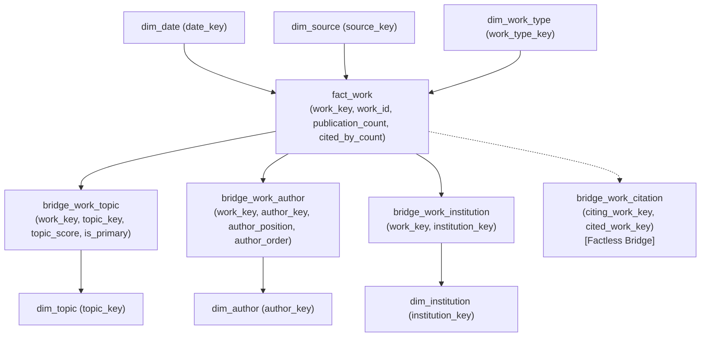

# Warehouse model

The `warehouse` schema is a separate analytical schema in the existing PostgreSQL
database. Its only input is the reconciled CSV snapshot in `data/processed/`; it
does not read raw OpenAlex JSON or the `openalex` relational schema.

## Grain and model

`fact_work` has one row per retained OpenAlex work. It contains the additive
`publication_count = 1` and the observed `cited_by_count` snapshot measure.



```text
dim_date       dim_source       dim_work_type
    \              |                /
                  fact_work
              /       |        \
 bridge_work_topic  bridge_work_author  bridge_work_institution
        |                  |                    |
    dim_topic        dim_author       dim_institution
```

`publication_year` remains on `fact_work` as a degenerate dimension. This
preserves the source year for works whose publication date is unavailable; those
facts use the explicit unknown row (`date_key = 0`) in `dim_date`.

## Full-association bridge rule

The project deliberately uses full association counting, as selected for this
implementation. A multi-topic work contributes one publication and its full
citation count to every assigned topic; the equivalent rule applies to authors
and institutions. Therefore, totals through a bridge are association-level
metrics and can exceed the corpus-wide totals from `fact_work` alone.

Use `fact_work` alone for corpus totals. Use a bridge only when the question is
about a related author, topic, or institution.

`bridge_work_citation` is a factless relationship bridge retained solely to
support the existing relational citation-path prototype. It is not a standard
OLAP fact.

## Load and query

Create the schema and indexes, then load a processed snapshot:

```bash
docker compose --env-file .env -f docker/compose.yaml exec -T postgres \
  psql -U openalex_app -d openalex < sql/warehouse/00_schema.sql
docker compose --env-file .env -f docker/compose.yaml exec -T postgres \
  psql -U openalex_app -d openalex < sql/warehouse/01_indexes.sql
python3 scripts/load/load_warehouse.py --processed-dir data/processed --reset
```

Run [warehouse analytical queries](../sql/warehouse/02_analytical_queries.sql)
with `psql`. `04_explain_analyze.sql` reports PostgreSQL execution time and
`05_compare_relational_timing.sql` places semantically equivalent relational and
warehouse queries side by side for timing comparison.
